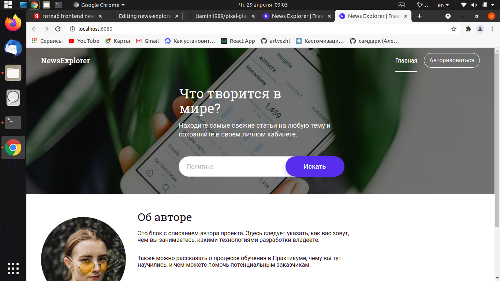

# Бэкэнд проекта news

Ссылка на api: https://api.pavlov-news.students.nomoreparties.xyz

## Роуты: 
### создаёт пользователя с переданными в теле email, password и name
POST /signup

### проверяет переданные в теле почту и пароль и возвращает JWT
POST /signin 

### возвращает информацию о пользователе (email и имя)
GET /users/me

### возвращает все сохранённые пользователем статьи
GET /articles

### создаёт статью с переданными в теле keyword, title, text, date, source, link и image
POST /articles

### удаляет сохранённую статью  по _id
DELETE /articles/articleId 

## Технологии:
* Express.js
* Node.js

## Запуск проекта
Для запуска необходим файл .env

`npm run start` — запускает сервер   
`npm run dev` — запускает сервер с hot-reload

