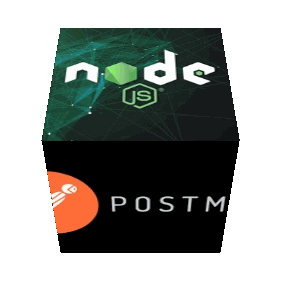

# Api проекта News Exploler

Ссылка на api: https://api.pavlov-news.students.nomoreparties.xyz
## Описание
Проект представляет из себя одностраничное приложение, в котором можно найти свежие статьи на любую тему и сохранить в личном кабинете. Основной функционал доступен после регистрации и авторизации пользователя.
Серверная часть проекта написана на архитектуре <a href='https://ru.wikipedia.org/wiki/REST'>REST<a> , с использованием <a href="https://nodejs.org/en/">NodeJS & npm<a> , фреймворка  <a href='https://expressjs.com'>Express<a>  и СУБД <a href='https://www.mongodb.com/'>MONGODB<a> . Организована централизованная обработка ошибок, сбор логов и валидация приходящих на сервер данных. Особый акцент сделан на безопасности веб-приложения. Облачный сервер для деплоя создан и сконфигурирован на мощностях  <a href='https://cloud.yandex.ru/'>`Yandex.Cloud`<a>. 

# Как все тут устроено?
## Роуты:
### создаёт пользователя с переданными в теле email, password и name
POST /signup

### проверяет переданные в теле почту и пароль и возвращает JWT
POST /signin 

### возвращает информацию о пользователе (email и имя)
GET /users/me

### возвращает все сохранённые пользователем статьи
GET /articles

### создаёт статью с переданными в теле keyword, title, text, date, source, link и image
POST /articles

### удаляет сохранённую статью  по _id
DELETE /articles/articleId 

## Технологии:
* Express.js
* Node.js

## Запуск проекта
Для запуска необходим файл .env

`npm run start` — запускает сервер   
`npm run dev` — запускает сервер с hot-reload

